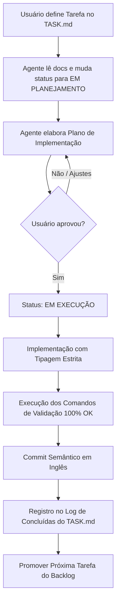

# Template de Desenvolvimento Orientado a Agentes (ADD - Agent-Driven Development)

Este repositório é um starter kit projetado para potencializar o desenvolvimento de software colaborativo com **agentes de Inteligência Artificial** (ex: Claude Code, Antigravity, Cursor, Windsurf, Roo Code, Aider, etc.).

A estrutura foi desenhada para resolver os maiores problemas no uso de agentes em projetos reais: **perda de contexto**, **alucinações em tarefas longas**, **violação de padrões de código** e **retrabalho**.

---

## 📁 Estrutura do Template

```text
├── AGENTS.md                 # A "Constituição" do projeto para o agente (regras inegociáveis, stack e comandos)
├── .agent/
│   ├── TASK.md               # Tarefa ativa, critérios de aceite e roadmap imediato
│   ├── NOTES.md              # Decisões arquiteturais rápidas, contratos de dados e armadilhas
│   ├── ARCHIVE.md            # Histórico de tarefas antigas (preserva contexto enxuto)
│   └── adr/                  # Registros de Decisões Arquiteturais complexas (ADRs formais)
│       └── 000-template.md   # Template padrão de ADR
├── .env.example              # Exemplo de variáveis de ambiente do projeto
├── .gitignore                # Padrão amplo (Node, Python, Docker, caches de agentes)
└── README.md                 # Este guia (para desenvolvedores humanos)
```

---

## 🚀 Como Iniciar um Novo Projeto com este Template

### Passo 1: Inicializar o Repositório Git
Se você clonou ou baixou este template, inicialize seu repositório local:
```bash
git init
git add .
git commit -m "chore: initial template setup"
```

### Passo 2: Configurar o `AGENTS.md`
Abra o arquivo [`AGENTS.md`](./AGENTS.md) e substitua todos os campos entre `[COLCHETES]`:
1. Nome do projeto e resumo da arquitetura.
2. Sistema operacional e **Shell padrão** do ambiente (ex: PowerShell ou Bash).
3. Stack tecnológico de cada serviço/módulo (linguagens, versões e gerenciadores de pacote).
4. Comandos exatos de validação (`testes`, `linter`, `checagem de tipos`, `build`).
5. Apague as seções que não se aplicarem (ex: seção Docker se o projeto não utilizar contêineres).
6. Remova a seção `Checklist Rápido de Adaptação` ao terminar.

### Passo 3: Configurar Variáveis de Ambiente
Copie o arquivo de exemplo e ajuste os valores necessários para seu ambiente local:
```bash
cp .env.example .env
```

### Passo 4: Definir a Primeira Tarefa no `.agent/TASK.md`
Abra [`.agent/TASK.md`](./.agent/TASK.md):
1. Preencha a seção **📌 Tarefa Ativa** com o primeiro objetivo real (ex: `Setup do esqueleto da API`).
2. Defina **Critérios de Aceite** claros e mensuráveis.
3. Marque o status inicial como `PRONTO PARA PLANEJAMENTO`.

### Passo 5: Iniciar o Trabalho com o Agente de IA
No prompt da sua ferramenta de IA favorita, instrua o agente:
> *"Leia o AGENTS.md, .agent/TASK.md e .agent/NOTES.md. Apresente seu plano de implementação para a Tarefa Ativa do TASK.md antes de alterar qualquer código."*

---

## 🔄 Fluxo de Trabalho (Ciclo de Vida de uma Tarefa)



---

## 💡 Melhores Práticas para Trabalhar com Agentes

1. **Uma coisa por vez:** Mantenha cada tarefa atômica. Se um pedido crescer, quebre em sub-tarefas no `TASK.md`.
2. **Confie no DoD (Definition of Done):** Não aceite tarefas com testes ou linter pendentes.
3. **Mantenha os arquivos enxutos:**
   - O `TASK.md` deve conter apenas a tarefa atual e títulos das próximas.
   - O `NOTES.md` guarda decisões e contratos que **não são óbvios olhando o diff do Git**.
   - Detalhes profundos de implementação pertencem às mensagens de commit e ao histórico do Git.
